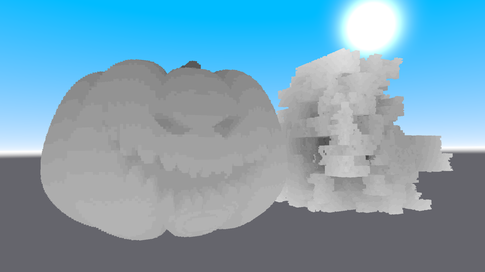

#  Easy Voxel Framework

A Unity framework for rendering large voxel scenes on GPU  
(This is a very early version. More detailed documentation will be available later)

## Installation

Clone repository into your Unity project

```bash
  git clone https://github.com/KvantoCat/Easy-Voxel-Framework-Unity.git
```

## Usage

Early version. I don't recommend using it now

